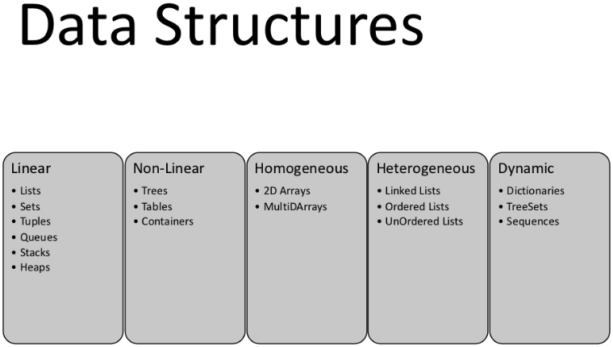

# Data Structures And Algorithms

A data structure is a particular way of organizing data in a computer so that it can be used effectively. The idea is to reduce the space and time complexities of different tasks. Data Structures can be classified as follows:

